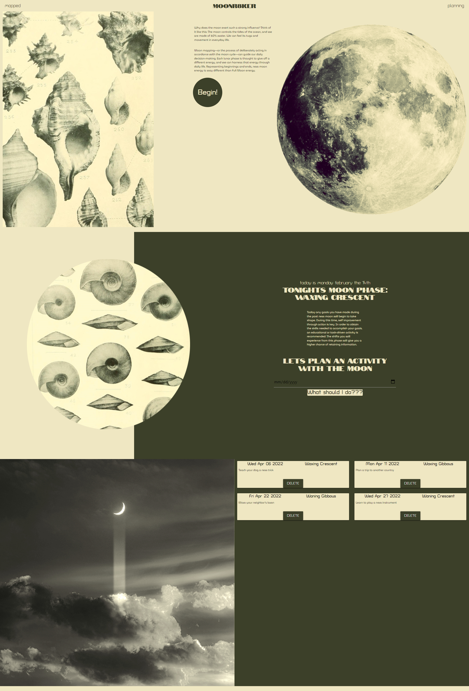

# Lunar Activities
View this page at https://danielmrva.github.io/Lunar-Activities/

Project Overview:
MOONR8KER is an application that crosses somewhere between astrology and gravitational science. While it hasn't been studied depthly, there is a belief that the moon's gravitational pull can have an influence over human behavior. This idea stems from the fact that the moons gravitational pull affects different elements on the earth - the best example being changing tides. 

An easy way for us to measure the distance the moon is from us, or the strength of its pull, is by looking at the shape (crescent for example) that the moon exhibits while in the nights sky. 

With the scientific moon phase information and the loose study of correlating human behavior - we can begin to plan our lives in accordance with the moons rotation. Following the moons behavior to plan ones life is often called "moon-mapping". This app aims to use those patterns to create a task that helps a user to harness the moons power.

How it works - APIs and Javascript:

When a user enters in a date, this app takes moon phase data from https://www.farmsense.net/ for that date and then attributes it to a random activity generated from https://www.boredapi.com. The bored api has activities that are arranged in nine main categories. These categories are then matched to the phase that is most appropriate.

There are three main areas and links to those areas in the nav bar- The main page (MOONR8KER), the main user experience page where they can plan an activity (planning), and the area with saved user activities (mapped).

A user can either scroll down or click "planning" in navigation to be brought to an area where they can generate an event. A user will come to this page looking for guidance on what to do during an upcoming date. They will choose a date on a calendar that they want to harness the moons power. Upon selecting a date, the phase of the moon during that time will display, along with a general description of best practices during that time, followed by a random activity.

This activity automatically saves to the mapped section of the website. The mapped area functions similar to a to-do list. It holds all of the activities that the user may want to take part in. These activities will order itself by date, from closest date to farthest date. These activities can also be removed from the section with the delete button.

Interface Design:

The user experience begins at "the landing page". The main design of this page is to feel airy and open- similar to space. Connections are often made between the ocean being unknown and space being unknown. Both can evoke a sense of calm. Therefore, a calm visual design is displayed with the incorporation of sea pictures and space pictures. 

Common themes in this design are circles, shells, and space. There are three main fonts implemented, one for title, one for subheadings, and one for paragraph text. There are also two main colors. Two colors mimic the appearance of the moon having only two colors. The use of minimal typefaces and colors also keeps the design consistent and clean throughout. The navigation bar is helpful to the user but does not include a lot of content to keep a clean airy appearance.

Screenshots Displayed Below:

